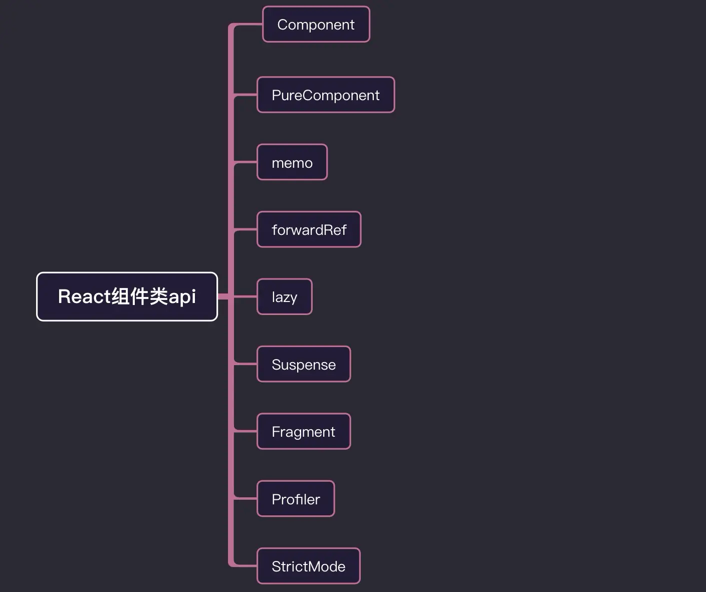

> 我在用 `React` 开发的时候，真正用到的 `React` 的 `api` 很少，但其实 `React` 暴露出来的 `api` 非常多，而且这些 `api` 并非没有用，都有它们各自的应用场景。所有我打算将 `React` 生产环境暴露的大部分 `api` 给复习一遍。

我会将 `React api` 分成 **组件类**、**工具类**、**hooks**、**react-dom**四个类别来进行复习。

## 组件类

组件类也可细分成三类：

- 用于继承的基类组件 `Component`、`PureComponent`
- `React` 内置组件 `Fragment`、`StrictMode`
- 高阶组件 `forwardRef`、`memo`、`lazy`、`Suspense`、`Profiler`



### Component

`Component` 是 `class` 组件的根基，类组件都是基于 `Component` 创建的，`React.Component` 的子类必须有个 `render`函数：

```js
class Welcome extends React.Component {
    render() {
        return <h1>Hello, { this.props.name }</h1>
    }
}
```

### PureComponent

`PureComponent` 和 `Component` 用法差不多，不同的是，基于 `PureComponent` 创建的组件会对 `props` 和 `state` 进行浅比较来决定是否重新渲染组件，一般可以用来进行**性能调优**，减少 `render` 次数。
**浅比较**即对值进行比较，如果是对象的话就对地址进行比较，不同则重新渲染，不会对对象内部数据进行比较。

```js
class Index extends React.PureComponent {

    constructor(props) {
        super(props)
        this.state = {
            num: 10,
            data: {
                name: "cgw",
                age: 28,
            },
        }
    }

    addNum = () => {
        let { num } = this.state
        this.setState({ num: ++num })
    }

    addAge = () => {
        const { data } = this.state
        data.age++
        this.setState({ data })
        // 改成下面这种方式就可以实现组件重新渲染
        // this.setState({ data: {...data} })
    }

    render() {
        const { num, data } = this.state;

        return (
            <div className="box">
                <div className="show">
                <div> num: { num } </div>
                {/* 点击组件重新渲染 */}
                <button onClick={ this.addNum }>num++</button>
                <div> 你的姓名是: { data.name } </div>
                <div> 年龄： { data.age }</div>
                {/* 点击组件不会重新渲染 */}
                <button onClick={ this.addAge }>age++</button>
                </div>
            </div>
        )
    }
}
```

### memo
`memo` 是[高阶组件](https://zh-hans.reactjs.org/docs/higher-order-components.html) ，和 `PureComponent` 作用类似，都可用来做**性能优化**。区别是 `memo` 只能对 `props` 的情况确认是否需要重新渲染，而 `PureComponent` 针对的是 `props` 和 `state`。

`React.memo` 接受两个参数，第一个参数是组件，第二个参数是一个函数，返回一个布尔值，返回 `true` 组件无需重新渲染，返回 `false` 则重新渲染，这个和 `shouldComponentUpdate()` 刚好相反。

```js
function TextMemo(props) {
    console.log('子组件渲染')
    const { num, number } = props

    return (
        <div>
            <div>子组件</div>
            <div>num: { num }</div>
            <div>number: { number }</div>
        </div>
    )
}

const NewTextMemo = React.memo(TextMemo, (pre, next) => {
    if(pre.number === next.number) { // number 值未变化，不重新渲染
        return true
    } else if(pre.number !== next.nubmer && next.number < 5) { // number 值小于5，不重新渲染
        return true
    } else { // 其他情况，重新渲染
        return false
    }
})

class Index extends React.Component {

    constructor(props) {
        super(props)
        this.state = {
            num: 1,
            number: 1
        }
    }

    render() {
        console.log('父组件渲染')
        let { num, number } = this.state
        return (
            <div>父组件</div>
            <div>
                num: { num }
                {/* num 改变，父组件重新渲染，子组件不重新渲染 */}
                <button onClick={() => this.setState({ num: ++num })}>num++</button>
                <button onClick={() => this.setState({ num: --num })}>num--</button>
            </div>
            <div>
                number: { number }
                {/* number 改变，父组件重新渲染；当 number 小于 5 时，子组件不重新渲染，大于 5 重新渲染 */}
                <button onClick={() => this.setState({ number: ++number })}>number++</button>
                <button onClick={() => this.setState({ number: --number })}>number--</button>
            </div>
            <NewTextMemo num={ num } number={ number } />
        )
    }
}
```
