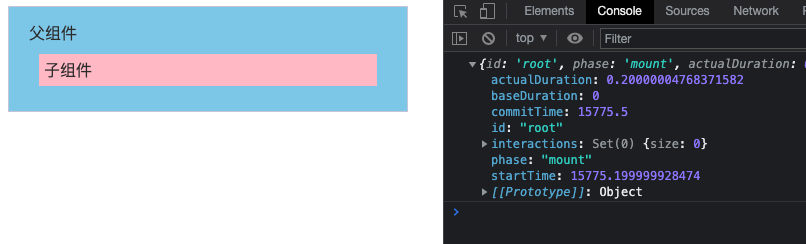
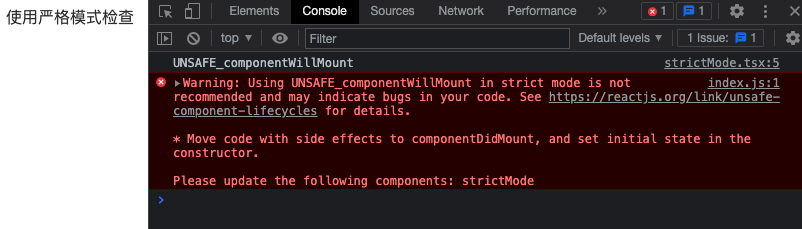
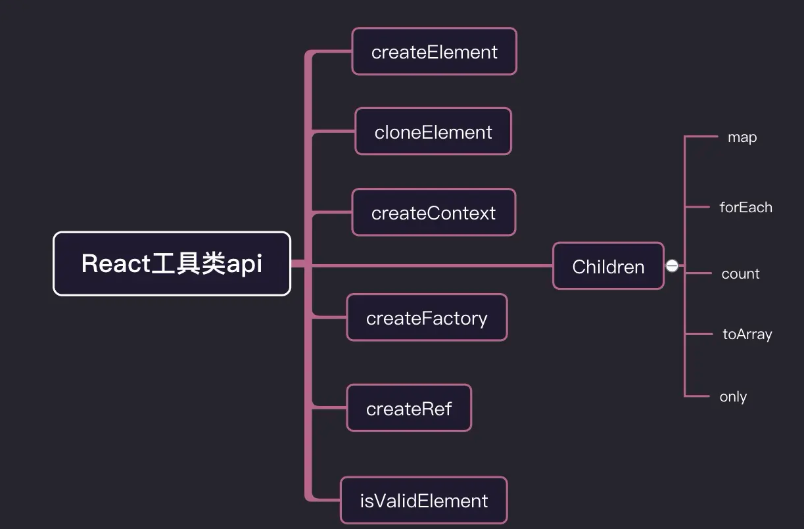

> 我在用 `React` 开发的时候，真正用到的 `React` 的 `api` 很少，但其实 `React` 暴露出来的 `api` 非常多，而且这些 `api` 并非没有用，都有它们各自的应用场景。所有我打算将 `React` 生产环境暴露的大部分 `api` 给复习一遍。

我会将 `React api` 分成 **组件类**、**工具类**、**hooks**、**react-dom**四个类别来进行复习。

## 组件类

组件类也可细分成三类：

- 用于继承的基类组件 `Component`、`PureComponent`
- `React` 内置组件 `Fragment`、`StrictMode`
- 高阶组件 `forwardRef`、`memo`、`lazy`、`Suspense`、`Profiler`


### [Component](src/pages/Component/component.tsx)
`Component` 是 `class` 组件的根基，类组件都是基于 `Component` 创建的，`React.Component` 的子类必须有个 `render`函数：

```js
class Welcome extends React.Component {
    render() {
        return <h1>Hello, { this.props.name }</h1>
    }
}
```

### [PureComponent](src/pages/Component/pureComp.tsx)
`PureComponent` 和 `Component` 用法差不多，不同的是，基于 `PureComponent` 创建的组件会对 `props` 和 `state` 进行浅比较来决定是否重新渲染组件，一般可以用来进行**性能调优**，减少 `render` 次数。
**浅比较**即对值进行比较，如果是对象的话就对地址进行比较，不同则重新渲染，不会对对象内部数据进行比较。

```js
class Index extends React.PureComponent {

    state = {
        num: 10,
        data: {
            name: "cgw",
            age: 28,
        },
    }

    addNum = () => {
        let { num } = this.state
        this.setState({ num: ++num })
    }

    addAge = () => {
        const { data } = this.state
        data.age++
        this.setState({ data })
        // 改成下面这种方式就可以实现组件重新渲染
        // this.setState({ data: {...data} })
    }

    render() {
        const { num, data } = this.state;

        return (
            <div className="box">
                <div className="show">
                    <div> num: { num } </div>
                    {/* 点击组件重新渲染 */}
                    <button onClick={ this.addNum }>num++</button>
                    <div> 你的姓名是: { data.name } </div>
                    <div> 年龄： { data.age }</div>
                    {/* 点击组件不会重新渲染 */}
                    <button onClick={ this.addAge }>age++</button>
                </div>
            </div>
        )
    }
}
```

### [memo](src/pages/Compoennt/memo.tsx)
`memo` 是[高阶组件](https://zh-hans.reactjs.org/docs/higher-order-components.html) ，和 `PureComponent` 作用类似，都可用来做**性能优化**。区别是 `memo` 只能对 `props` 的情况确认是否需要重新渲染，而 `PureComponent` 针对的是 `props` 和 `state`。

`React.memo` 接受两个参数，第一个参数是组件，第二个参数是一个函数，返回一个布尔值，返回 `true` 组件无需重新渲染，返回 `false` 则重新渲染，这个和 `shouldComponentUpdate()` 刚好相反。

```js
function TextMemo(props) {
    console.log('子组件渲染')
    const { num, number } = props

    return (
        <div>
            <div>子组件</div>
            <div>num: { num }</div>
            <div>number: { number }</div>
        </div>
    )
}

const NewTextMemo = React.memo(TextMemo, (pre, next) => {
    if(pre.number === next.number) { // number 值未变化，不重新渲染
        return true
    } else if(pre.number !== next.nubmer && next.number < 5) { // number 值小于5，不重新渲染
        return true
    } else { // 其他情况，重新渲染
        return false
    }
})

class Index extends React.Component {

    state = {
        num: 1,
        number: 1
    }

    render() {
        console.log('父组件渲染')
        let { num, number } = this.state
        return (
            <div>
                <div>父组件</div>
                <div>
                    num: { num }
                    {/* num 改变，父组件重新渲染，子组件不重新渲染 */}
                    <button onClick={() => this.setState({ num: ++num })}>num++</button>
                    <button onClick={() => this.setState({ num: --num })}>num--</button>
                </div>
                <div>
                    number: { number }
                    {/* number 改变，父组件重新渲染；当 number 小于 5 时，子组件不重新渲染，大于 5 重新渲染 */}
                    <button onClick={() => this.setState({ number: ++number })}>number++</button>
                    <button onClick={() => this.setState({ number: --number })}>number--</button>
                </div>
                <NewTextMemo num={ num } number={ number } />
            </div>
        )
    }
}
```


### [forwardRef](src/pages/Component/forwardRef.tsx)
有的时候，我们会希望在父组件获取子组件的某一个 `dom` 元素，但 `react` 不允许 `ref` 通过 `props` 传递，因为组件上已经有 `ref` 这个属性，`forwardRef` 出现就是解决这个问题。

`React.forwardRef` 接受渲染函数作为参数，用 `props` 和 `ref` 来当该渲染函数的参数调用该函数，返回一个 `React` 组件，这个组件能够接受 `ref` ，并将其向下转发，这就可以实现在父组件获取子组件里的 `dom` 元素了。

```js
const Son = React.forwardRef((props, ref) => {
    return (
        <div>
            <div> 子组件 </div>
            <span ref={ref} >要获取的元素</span>
        </div>
    )
}) 

const Father = () => {

    const ref = React.createRef()

    useEffect(() => {
      console.log(ref, '获取子组件的dom元素')
    }, [ref])

    return (
        <div>
            <div>父组件</div>
            <Son ref={ref}  />
        </div>
    )
}

```

### [lazy](src/pages/Component/lazyIndex.tsx)
> **注意：**
> `React.lazy` 和 `Suspense` 技术还不支持服务端渲染。如果你想在使用服务端渲染的应用中使用，可以使用 [Loadable Components](https://github.com/gregberge/loadable-components) 这个库。

`React.lazy` 可以定义懒加载组件，配合 `Suspense` 使用可以实现动态加载组件的效果。`React.lazy` 接受一个函数，这个函数必须返回一个 `Promise` ， 该 `Promise` 需要 `resolve` 一个 `default export` 的 `React` 组件。

```js
/** src/pages/Component/lazyTest.tsx */
class Test extends React.Component{
    componentDidMount(){
        console.log('组件渲染')
    }

    render(){
        return (
            <div className="img">
                
            </div>
        )
    }
}
export default Test

/** src/pages/Component/lazyIndex.tsx */
import lazyTest from './lazyTest'

const LazyComponent = React.lazy(() => new Promise(resolve => {
    // 用 setTimeout 来模拟 import 异步引入效果
    setTimeout(()=>{
        resolve({
            default: ()=> <lazyTest />
        })
    }, 2000)
}))

/**
const LazyComponent = React.lazy(() => import('./lazyTest.js'))
*/

class LazyIndex extends React.Component{   
    render(){
        return (
            <div className="box" >
                <React.Suspense fallback={ <div className="loading"></div> } >
                    <LazyComponent />
                </React.Suspense>
            </div>
        )
    }
}
```
**效果**


### [Suspense](src/pages/Component/lazyIndex.tsx)
`Suspense` 可以通过 `fallback` 属性指定 `React` 元素为加载指示器，在子组件尚未具备渲染条件的时候展示该元素，目前懒加载组件（`React.lazy`）是 `Suspense` 支持的唯一用例。

`Suspense` 组件可以置于懒加载组件之上的任何位置，一个 `Suspense` 组件可以包裹多个懒加载组件。
```js
// 该组件是动态加载的
const OtherComponent = React.lazy(() => import('./OtherComponent'));

function MyComponent() {
    return (
        // 显示 <Loading> 组件直至 OtherComponent 加载完成
        <React.Suspense fallback={<Loading />}>
            <OtherComponent />
        </React.Suspense>
    );
}
```

### [Fragment](src/pages/Component/fragment.tsx)
`react` 不允许一个组件返回多个节点元素，但我们有的时候又会有这种需求，例如：
```js
class Table extends React.Component {
    render() {
        return (
            <table>
                <tr>
                    <Columns />
                </tr>
            </table>
        )
    }
}
```
`<Columns />` 组件需要返回多个 `<td>` 元素才能让渲染的 `HTML` 有效，但 `react` 不支持下面的写法：
```js
class Columns extends React.Component {
    render() {
        return (
            <td>Hello</td>
            <td>World</td>
        )
    }
}
```
我们可以在外层套一个 `div`，但是这样生成的 `HTML` 会增加额外的 `dom` 元素：
```js
<div>
    <td>Hello</td>
    <td>World</td>
</div>
```
`Fragment` 的出现就解决了这个问题，它可以让一个组件返回多个元素，而且不会增加额外的 `dom` 元素：
```js
<React.Fragment>
    <td>Hello</td>
    <td>World</td>
</React.Fragment>
```
还可以使用它的短语法进行简写，和 `Fragment` 的区别是，`Fragment` 可以支持 `key` 属性，`<></>` 不支持：
```js
<>
    <td>Hello</td>
    <td>World</td>
</>
```
我们常用的 `map` 遍历返回的元素，`react` 会默认在外层套一个 `Fragment`
```js
{ ['Hello', 'World'].map(item => <td key={item}> {item} </td>) }
```
`react` 处理后：
```js
<React.Fragment>
    <td key="Hello"> Hello </td>
    <td key="World"> World </td>
</React.Fragment>
```

### [Profiler](src/pages/Component/profiler.tsx)
`Profiler` 是开发环境下用来进行性能检测的 `api`，可以添加在 `React` 树的任何地方来检测这部分 `React` 组件渲染用时及性能开销。它接受两个参数：
* `id`：用来标识唯一性
* `onRender`：回调函数，渲染完成后执行

```js
const Text = () => {
    return (
        <div>
            子组件
        </div>
    )
}

const ProfilerComponent = () => {

    const callback = (id, phase, actualDuration, baseDuration, startTime, commitTime, interactions) => {
        let props = { id, phase, actualDuration, baseDuration, startTime, commitTime, interactions }
        console.log(props)
    }

    return (
        <div>
            <React.Profiler id="root" onRender={callback}>
                <div>父组件</div>
                <Text />  
            </React.Profiler>
        </div>
    )
}
```


`onRender` 函数接受七个参数：
* `id (string)`: 发生渲染的 `Profiler` 的id，如果有多个 `Profiler`，它可以用来分辨是哪一个发生的渲染
* `phase ("mount" | "update")`: 判断是第一次挂载渲染，还是由 `props`、`state` 或 `hooks` 改变引起的重渲染
* `actualDuration (number)`: 本次更新 `committed` 花费的渲染时间
* `baseDuration (number)`: 估计不使用 `memoization` 的情况下渲染整颗子树需要的时间
* `startTiem (number)`: 本次更新开始渲染的时间
* `commitTime (number)`: 本次更新 `committed` 的时间
* `interactions (Set{})`: 本次更新的 `interactions` 的集合

### [StrictMode](src/pages/Component/strictMode.tsx)
`StrictMode` 严格模式用于检测 `React` 项目中存在的潜在问题，和 `Fragment` 一样，不会渲染任何可见的 `UI`，仅为后代元素触发额外的检查和警告。
> 严格模式检查仅在开发模式下运行；它们不会影响生产构建。

`StrictMode` 目前有助于：
* [识别不安全的生命周期](https://zh-hans.reactjs.org/docs/strict-mode.html#identifying-unsafe-lifecycles)
* [使用过期字符串 ref API 的警告](https://zh-hans.reactjs.org/docs/strict-mode.html#warning-about-legacy-string-ref-api-usage)
* [使用废弃的 findDOMNode 方法的警告](https://zh-hans.reactjs.org/docs/strict-mode.html#warning-about-deprecated-finddomnode-usage)
* [检测意外的副作用](https://zh-hans.reactjs.org/docs/strict-mode.html#detecting-unexpected-side-effects)
* [检测过时的 context API](https://zh-hans.reactjs.org/docs/strict-mode.html#detecting-legacy-context-api)

**一般在最外层开启严格模式：**
```js
ReactDOM.render(
    <React.StrictMode>
        <App />
    </React.StrictMode>,
    document.getElementById('root')
)
```
**在内部使用不安全的生命周期：**
```js
class strictMode extends React.Component{    
    UNSAFE_componentWillMount(){
        console.log('UNSAFE_componentWillMount')
    }
    render(){      
        return <div> 使用严格模式检查 </div> 
    }
}
```
**结果：**



## 工具类

下面要复习的是 `React` 工具类 `API` 的用法：



### [createElement](src/pages/Tools/createElement.tsx)
我们现在写 `React` 一般都是用 `JSX` 的格式，而我们写的 `JSX` 最终都会被 `babel` 用 `createElement` 编译成 `React` 元素形式。
例如：
```js
return (
    <div className="box">
        <div className="title">生命周期</div>
        <React.Fragment>Flagment</React.Fragment>
        文本
    </div>
)
```
会被编译成：
```js
return React.createElement("div", { className: "box" },
        React.createElement("div", { className: "title" }, "\u751F\u547D\u5468\u671F"),
        React.createElement(React.Fragment, null, "Flagment"),
        "\u6587\u672C")
```

`createElement` 的使用方法：
```js
React.createElement(
    type,
    [props],
    [...children]
)
```
* 第一个参数是组件类型，可以传入组件名或 `dom` 元素类型
* 第二个参数是一个对象，在 `dom` 类型中为属性，组件类型为 `props`
* 后续参数为 `children` 子元素或子组件
  
### [cloneElement](src/pages/Tools/cloneElement.tsx)
`cloneElement` 顾名思义就是用来克隆元素的，以 `element` 元素为样板克隆并返回新的 `React` 元素，返回元素的 `props` 是将新的 `props` 与原始元素的 `props` 浅层合并后的结果。

```js
function TestComponent(props) {
    return (
        <div>{props.name}</div>
    )
}


function Index() {
    const element = <TestComponent name='test' />
    return (
        <div>
            { element }
            {React.cloneElement(element, { name: 'clone' })}
        </div>
    )
}
```

`cloneElement` 的使用方法：
```js
React.cloneElement(
    element,
    [config],
    [...children]
)
```
* 第一个参数是 `element` 元素
* 第二个参数可以包含 `props`、`key`、`ref`
* 后续参数为 `children` 子元素或子组件
  
### [createContext](src/pages/Tools/createContext.tsx)
`createContext` 用于创建一个 `Context` 对象，当 `React` 渲染一个订阅了 `Context` 对象的组件，这个组件会从组件树中离自身最近的 `Provider` 中读取当前的 `Context` 的值，如果没有匹配到 `Provider`，那么就会获取 `defaultValue` 的值。
```js
const MyContext = React.createContext(defaultValue)
```

每个 `Context` 对象都会返回一个 `Provider` 和 `Consumer` 组件。`Provider` 接收一个 `value` 属性并传递给内部的消费组件 `Consumer`；`Consumer` 订阅 `Context` 的变化，当 `Provider` 的 `value` 值变化时会重新渲染。

```js
const MyContext = React.createContext({})

function Test(props) {

    const { name, age } = props

    return (
        <div>
            <div>姓名：{ name }</div>
            <div>年龄：{ age }</div>
        </div>
    )
}

function ConsumerComponent() {
    return (
        <MyContext.Consumer>
            { value => <Test {...value} /> }
        </MyContext.Consumer>
    )
}

function ProviderComponent() {
    return (
        <MyContext.Provider value={{ name: 'cgw', age: 18 }}>
            <ConsumerComponent />
        </MyContext.Provider>
    )
}
```

### [createFactory](src/pages/Tools/createFactory.tsx)
`createFactory` 用于返回生成制定类型 `React` 元素的函数，作用与 `createElement` 类似，类型参数可以使标签名字符串（像是 `'div'` 或 `'span'`），也可以是 `React` 组件类型，或是 `React Fragment` 类型。

```js
const Test = () => {
    return ( <div>Test</div> )
}

const Index = () => {

    const Text = React.createFactory(() => <div>createFactory创建的div</div>)
    const TestFactory = React.createFactory(Test)

    return (
        <div>
            <Text />
            <TestFactory />
        </div>
    )
}
```

此辅助函数已废弃，建议使用 `JSX` 语法或直接调用 `React.createElement` 来替代它。


