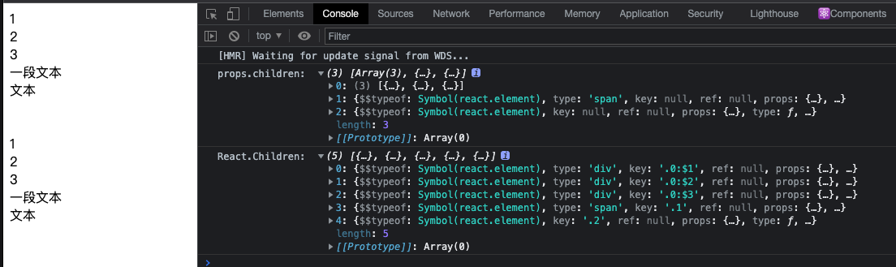
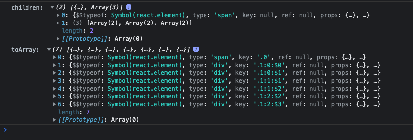
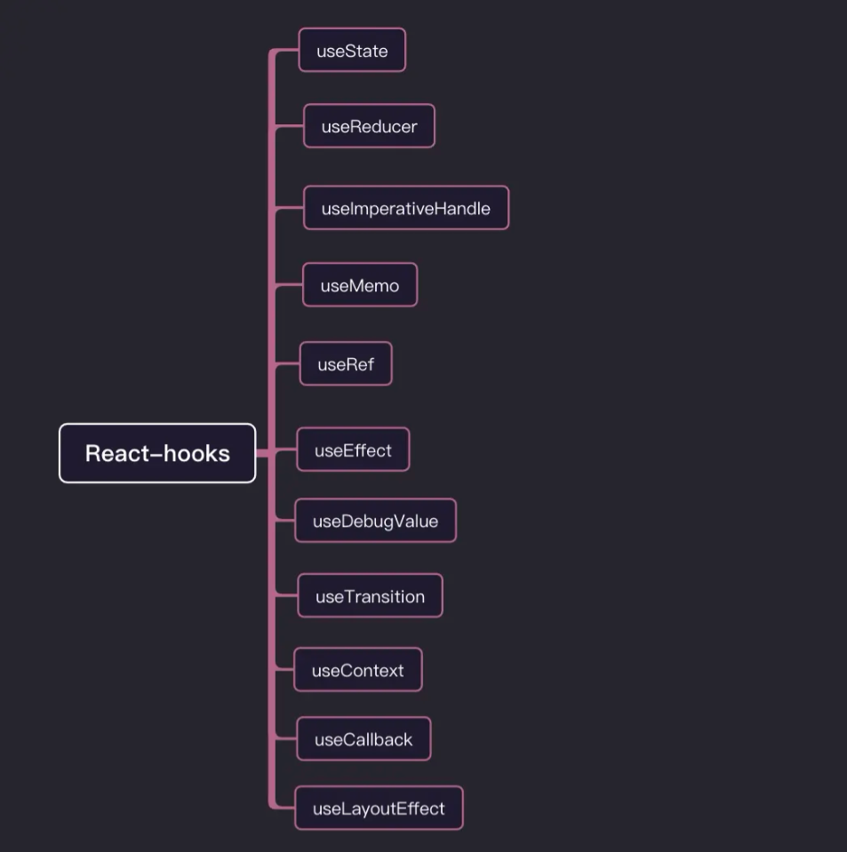
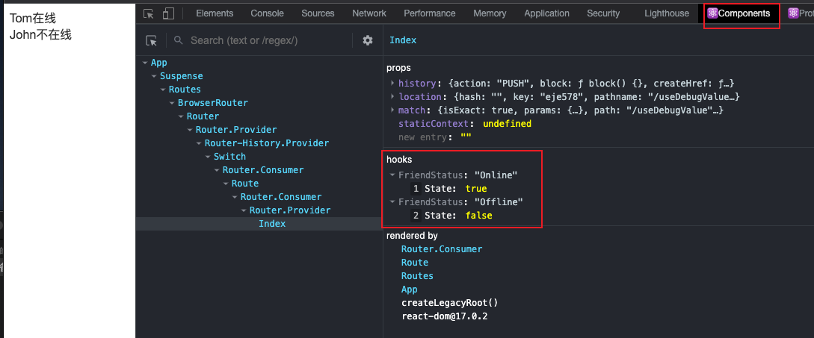
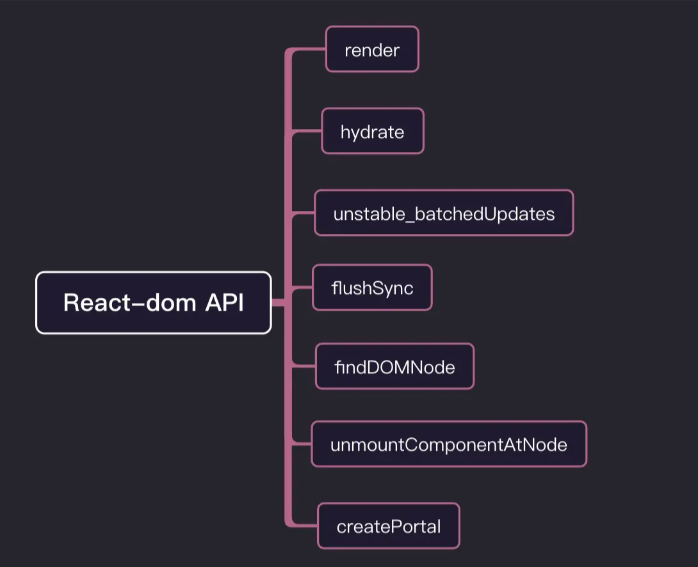

> 我在用 `React` 开发的时候，真正用到的 `React` 的 `api` 很少，但其实 `React` 暴露出来的 `api` 非常多，而且这些 `api` 并非没有用，都有它们各自的应用场景。所有我打算将 `React` 生产环境暴露的大部分 `api` 给复习一遍。

我会将 `React api` 分成 **组件类**、**工具类**、**hooks**、**react-dom**四个类别来进行复习。

## 组件类

组件类也可细分成三类：

- 用于继承的基类组件 `Component`、`PureComponent`
- `React` 内置组件 `Fragment`、`StrictMode`
- 高阶组件 `forwardRef`、`memo`、`lazy`、`Suspense`、`Profiler`


### [Component](src/pages/Component/component.tsx)
`Component` 是 `class` 组件的根基，类组件都是基于 `Component` 创建的，`React.Component` 的子类必须有个 `render`函数：

```js
class Welcome extends React.Component {
    render() {
        return <h1>Hello, { this.props.name }</h1>
    }
}
```

### [PureComponent](src/pages/Component/pureComp.tsx)
`PureComponent` 和 `Component` 用法差不多，不同的是，基于 `PureComponent` 创建的组件会对 `props` 和 `state` 进行浅比较来决定是否重新渲染组件，一般可以用来进行**性能调优**，减少 `render` 次数。
**浅比较**即对值进行比较，如果是对象的话就对地址进行比较，不同则重新渲染，不会对对象内部数据进行比较。

```js
class Index extends React.PureComponent {

    state = {
        num: 10,
        data: {
            name: "cgw",
            age: 28,
        },
    }

    addNum = () => {
        let { num } = this.state
        this.setState({ num: ++num })
    }

    addAge = () => {
        const { data } = this.state
        data.age++
        this.setState({ data })
        // 改成下面这种方式就可以实现组件重新渲染
        // this.setState({ data: {...data} })
    }

    render() {
        const { num, data } = this.state;

        return (
            <div className="box">
                <div className="show">
                    <div> num: { num } </div>
                    {/* 点击组件重新渲染 */}
                    <button onClick={ this.addNum }>num++</button>
                    <div> 你的姓名是: { data.name } </div>
                    <div> 年龄： { data.age }</div>
                    {/* 点击组件不会重新渲染 */}
                    <button onClick={ this.addAge }>age++</button>
                </div>
            </div>
        )
    }
}
```

### [memo](src/pages/Compoennt/memo.tsx)
`memo` 是[高阶组件](https://zh-hans.reactjs.org/docs/higher-order-components.html) ，和 `PureComponent` 作用类似，都可用来做**性能优化**。区别是 `memo` 只能对 `props` 的情况确认是否需要重新渲染，而 `PureComponent` 针对的是 `props` 和 `state`。

`React.memo` 接受两个参数，第一个参数是组件，第二个参数是一个函数，返回一个布尔值，返回 `true` 组件无需重新渲染，返回 `false` 则重新渲染，这个和 `shouldComponentUpdate()` 刚好相反。

```js
function TextMemo(props) {
    console.log('子组件渲染')
    const { num, number } = props

    return (
        <div>
            <div>子组件</div>
            <div>num: { num }</div>
            <div>number: { number }</div>
        </div>
    )
}

const NewTextMemo = React.memo(TextMemo, (pre, next) => {
    if(pre.number === next.number) { // number 值未变化，不重新渲染
        return true
    } else if(pre.number !== next.nubmer && next.number < 5) { // number 值小于5，不重新渲染
        return true
    } else { // 其他情况，重新渲染
        return false
    }
})

class Index extends React.Component {

    state = {
        num: 1,
        number: 1
    }

    render() {
        console.log('父组件渲染')
        let { num, number } = this.state
        return (
            <div>
                <div>父组件</div>
                <div>
                    num: { num }
                    {/* num 改变，父组件重新渲染，子组件不重新渲染 */}
                    <button onClick={() => this.setState({ num: ++num })}>num++</button>
                    <button onClick={() => this.setState({ num: --num })}>num--</button>
                </div>
                <div>
                    number: { number }
                    {/* number 改变，父组件重新渲染；当 number 小于 5 时，子组件不重新渲染，大于 5 重新渲染 */}
                    <button onClick={() => this.setState({ number: ++number })}>number++</button>
                    <button onClick={() => this.setState({ number: --number })}>number--</button>
                </div>
                <NewTextMemo num={ num } number={ number } />
            </div>
        )
    }
}
```


### [forwardRef](src/pages/Component/forwardRef.tsx)
有的时候，我们会希望在父组件获取子组件的某一个 `dom` 元素，但 `react` 不允许 `ref` 通过 `props` 传递，因为组件上已经有 `ref` 这个属性，`forwardRef` 出现就是解决这个问题。

`React.forwardRef` 接受渲染函数作为参数，用 `props` 和 `ref` 来当该渲染函数的参数调用该函数，返回一个 `React` 组件，这个组件能够接受 `ref` ，并将其向下转发，这就可以实现在父组件获取子组件里的 `dom` 元素了。

```js
const Son = React.forwardRef((props, ref) => {
    return (
        <div>
            <div> 子组件 </div>
            <span ref={ref} >要获取的元素</span>
        </div>
    )
}) 

const Father = () => {

    const ref = React.createRef()

    useEffect(() => {
      console.log(ref, '获取子组件的dom元素')
    }, [ref])

    return (
        <div>
            <div>父组件</div>
            <Son ref={ref}  />
        </div>
    )
}

```

### [lazy](src/pages/Component/lazyIndex.tsx)
> **注意：**
> `React.lazy` 和 `Suspense` 技术还不支持服务端渲染。如果你想在使用服务端渲染的应用中使用，可以使用 [Loadable Components](https://github.com/gregberge/loadable-components) 这个库。

`React.lazy` 可以定义懒加载组件，配合 `Suspense` 使用可以实现动态加载组件的效果。`React.lazy` 接受一个函数，这个函数必须返回一个 `Promise` ， 该 `Promise` 需要 `resolve` 一个 `default export` 的 `React` 组件。

```js
/** src/pages/Component/lazyTest.tsx */
class Test extends React.Component{
    componentDidMount(){
        console.log('组件渲染')
    }

    render(){
        return (
            <div className="img">
                
            </div>
        )
    }
}
export default Test

/** src/pages/Component/lazyIndex.tsx */
import lazyTest from './lazyTest'

const LazyComponent = React.lazy(() => new Promise(resolve => {
    // 用 setTimeout 来模拟 import 异步引入效果
    setTimeout(()=>{
        resolve({
            default: ()=> <lazyTest />
        })
    }, 2000)
}))

/**
const LazyComponent = React.lazy(() => import('./lazyTest.js'))
*/

class LazyIndex extends React.Component{   
    render(){
        return (
            <div className="box" >
                <React.Suspense fallback={ <div className="loading"></div> } >
                    <LazyComponent />
                </React.Suspense>
            </div>
        )
    }
}
```
**效果**


### [Suspense](src/pages/Component/lazyIndex.tsx)
`Suspense` 可以通过 `fallback` 属性指定 `React` 元素为加载指示器，在子组件尚未具备渲染条件的时候展示该元素，目前懒加载组件（`React.lazy`）是 `Suspense` 支持的唯一用例。

`Suspense` 组件可以置于懒加载组件之上的任何位置，一个 `Suspense` 组件可以包裹多个懒加载组件。
```js
// 该组件是动态加载的
const OtherComponent = React.lazy(() => import('./OtherComponent'));

function MyComponent() {
    return (
        // 显示 <Loading> 组件直至 OtherComponent 加载完成
        <React.Suspense fallback={<Loading />}>
            <OtherComponent />
        </React.Suspense>
    );
}
```

### [Fragment](src/pages/Component/fragment.tsx)
`react` 不允许一个组件返回多个节点元素，但我们有的时候又会有这种需求，例如：
```js
class Table extends React.Component {
    render() {
        return (
            <table>
                <tr>
                    <Columns />
                </tr>
            </table>
        )
    }
}
```
`<Columns />` 组件需要返回多个 `<td>` 元素才能让渲染的 `HTML` 有效，但 `react` 不支持下面的写法：
```js
class Columns extends React.Component {
    render() {
        return (
            <td>Hello</td>
            <td>World</td>
        )
    }
}
```
我们可以在外层套一个 `div`，但是这样生成的 `HTML` 会增加额外的 `dom` 元素：
```js
<div>
    <td>Hello</td>
    <td>World</td>
</div>
```
`Fragment` 的出现就解决了这个问题，它可以让一个组件返回多个元素，而且不会增加额外的 `dom` 元素：
```js
<React.Fragment>
    <td>Hello</td>
    <td>World</td>
</React.Fragment>
```
还可以使用它的短语法进行简写，和 `Fragment` 的区别是，`Fragment` 可以支持 `key` 属性，`<></>` 不支持：
```js
<>
    <td>Hello</td>
    <td>World</td>
</>
```
我们常用的 `map` 遍历返回的元素，`react` 会默认在外层套一个 `Fragment`
```js
{ ['Hello', 'World'].map(item => <td key={item}> {item} </td>) }
```
`react` 处理后：
```js
<React.Fragment>
    <td key="Hello"> Hello </td>
    <td key="World"> World </td>
</React.Fragment>
```

### [Profiler](src/pages/Component/profiler.tsx)
`Profiler` 是开发环境下用来进行性能检测的 `api`，可以添加在 `React` 树的任何地方来检测这部分 `React` 组件渲染用时及性能开销。它接受两个参数：
* `id`：用来标识唯一性
* `onRender`：回调函数，渲染完成后执行

```js
const Text = () => {
    return (
        <div>
            子组件
        </div>
    )
}

const ProfilerComponent = () => {

    const callback = (id, phase, actualDuration, baseDuration, startTime, commitTime, interactions) => {
        let props = { id, phase, actualDuration, baseDuration, startTime, commitTime, interactions }
        console.log(props)
    }

    return (
        <div>
            <React.Profiler id="root" onRender={callback}>
                <div>父组件</div>
                <Text />  
            </React.Profiler>
        </div>
    )
}
```


`onRender` 函数接受七个参数：
* `id (string)`: 发生渲染的 `Profiler` 的id，如果有多个 `Profiler`，它可以用来分辨是哪一个发生的渲染
* `phase ("mount" | "update")`: 判断是第一次挂载渲染，还是由 `props`、`state` 或 `hooks` 改变引起的重渲染
* `actualDuration (number)`: 本次更新 `committed` 花费的渲染时间
* `baseDuration (number)`: 估计不使用 `memoization` 的情况下渲染整颗子树需要的时间
* `startTiem (number)`: 本次更新开始渲染的时间
* `commitTime (number)`: 本次更新 `committed` 的时间
* `interactions (Set{})`: 本次更新的 `interactions` 的集合

### [StrictMode](src/pages/Component/strictMode.tsx)
`StrictMode` 严格模式用于检测 `React` 项目中存在的潜在问题，和 `Fragment` 一样，不会渲染任何可见的 `UI`，仅为后代元素触发额外的检查和警告。
> 严格模式检查仅在开发模式下运行；它们不会影响生产构建。

`StrictMode` 目前有助于：
* [识别不安全的生命周期](https://zh-hans.reactjs.org/docs/strict-mode.html#identifying-unsafe-lifecycles)
* [使用过期字符串 ref API 的警告](https://zh-hans.reactjs.org/docs/strict-mode.html#warning-about-legacy-string-ref-api-usage)
* [使用废弃的 findDOMNode 方法的警告](https://zh-hans.reactjs.org/docs/strict-mode.html#warning-about-deprecated-finddomnode-usage)
* [检测意外的副作用](https://zh-hans.reactjs.org/docs/strict-mode.html#detecting-unexpected-side-effects)
* [检测过时的 context API](https://zh-hans.reactjs.org/docs/strict-mode.html#detecting-legacy-context-api)

**一般在最外层开启严格模式：**
```js
ReactDOM.render(
    <React.StrictMode>
        <App />
    </React.StrictMode>,
    document.getElementById('root')
)
```
**在内部使用不安全的生命周期：**
```js
class strictMode extends React.Component{    
    UNSAFE_componentWillMount(){
        console.log('UNSAFE_componentWillMount')
    }
    render(){      
        return <div> 使用严格模式检查 </div> 
    }
}
```
**结果：**


## 工具类

下面要复习的是 `React` 工具类 `API` 的用法：


### [createElement](src/pages/Tools/createElement.tsx)
我们现在写 `React` 一般都是用 `JSX` 的格式，而我们写的 `JSX` 最终都会被 `babel` 用 `createElement` 编译成 `React` 元素形式。
例如：
```js
return (
    <div className="box">
        <div className="title">生命周期</div>
        <React.Fragment>Flagment</React.Fragment>
        文本
    </div>
)
```
会被编译成：
```js
return React.createElement("div", { className: "box" },
        React.createElement("div", { className: "title" }, "\u751F\u547D\u5468\u671F"),
        React.createElement(React.Fragment, null, "Flagment"),
        "\u6587\u672C")
```

`createElement` 的使用方法：
```js
React.createElement(
    type,
    [props],
    [...children]
)
```
* 第一个参数是组件类型，可以传入组件名或 `dom` 元素类型
* 第二个参数是一个对象，在 `dom` 类型中为属性，组件类型为 `props`
* 后续参数为 `children` 子元素或子组件
  
### [cloneElement](src/pages/Tools/cloneElement.tsx)
`cloneElement` 顾名思义就是用来克隆元素的，以 `element` 元素为样板克隆并返回新的 `React` 元素，返回元素的 `props` 是将新的 `props` 与原始元素的 `props` 浅层合并后的结果。

```js
function TestComponent(props) {
    return (
        <div>{props.name}</div>
    )
}


function Index() {
    const element = <TestComponent name='test' />
    return (
        <div>
            { element }
            {React.cloneElement(element, { name: 'clone' })}
        </div>
    )
}
```

`cloneElement` 的使用方法：
```js
React.cloneElement(
    element,
    [config],
    [...children]
)
```
* 第一个参数是 `element` 元素
* 第二个参数可以包含 `props`、`key`、`ref`
* 后续参数为 `children` 子元素或子组件
  
### [createContext](src/pages/Tools/createContext.tsx)
`createContext` 用于创建一个 `Context` 对象，当 `React` 渲染一个订阅了 `Context` 对象的组件，这个组件会从组件树中离自身最近的 `Provider` 中读取当前的 `Context` 的值，如果没有匹配到 `Provider`，那么就会获取 `defaultValue` 的值。
```js
const MyContext = React.createContext(defaultValue)
```

每个 `Context` 对象都会返回一个 `Provider` 和 `Consumer` 组件。`Provider` 接收一个 `value` 属性并传递给内部的消费组件 `Consumer`；`Consumer` 订阅 `Context` 的变化，当 `Provider` 的 `value` 值变化时会重新渲染。

```js
const MyContext = React.createContext({})

function Test(props) {

    const { name, age } = props

    return (
        <div>
            <div>姓名：{ name }</div>
            <div>年龄：{ age }</div>
        </div>
    )
}

function ConsumerComponent() {
    return (
        <MyContext.Consumer>
            { value => <Test {...value} /> }
        </MyContext.Consumer>
    )
}

function ProviderComponent() {
    return (
        <MyContext.Provider value={{ name: 'cgw', age: 18 }}>
            <ConsumerComponent />
        </MyContext.Provider>
    )
}
```

### [createFactory](src/pages/Tools/createFactory.tsx)
`createFactory` 用于返回生成制定类型 `React` 元素的函数，作用与 `createElement` 类似，类型参数可以使标签名字符串（像是 `'div'` 或 `'span'`），也可以是 `React` 组件类型，或是 `React Fragment` 类型。

```js
const Test = () => {
    return ( <div>Test</div> )
}

const Index = () => {

    const Text = React.createFactory(() => <div>createFactory创建的div</div>)
    const TestFactory = React.createFactory(Test)

    return (
        <div>
            <Text />
            <TestFactory />
        </div>
    )
}
```

此辅助函数已废弃，建议使用 `JSX` 语法或直接调用 `React.createElement` 来替代它。

### [createRef](src/pages/Tools/createRef.tsx)
`createRef` 可以创建一个 `ref` 元素，附加在 `react` 元素上。

```js
class Index extends React.Component {

    node = React.createRef()

    componentDidMount() {
        console.log('createRef：', this.node)
    }

    render() {
        return (<div ref={this.node}> createRef </div>)
    }
}
```

在 `class` 组件中还可以这样获取 `ref`：

```js
class Index extends React.Component {

    node = null

    componentDidMount() {
        console.log('ref：', this.node)
    }

    render() {
        return (<div ref={ref => this.node = ref}> ref </div>)
    }
}
```

在函数组件可以使用 `useRef` 来获取 `ref`：

```js
const Index = () => {

    const node = useRef(null)

    useEffect(() => {
        console.log('useRef：', node)
    }, [node])

    return (<div ref={node}> useRef </div>)
}
```


### [isValidElement](src/pages/Tools/isValidElement.tsx)
验证接收的参数是否为 `React` 元素，返回 `true` 或 `false`。

```js
const Text = () => {
    return ( <div> 我是一个组件 </div> )
}

const IsValidElement = props => {

    // 三段文字都会展示
    // return props.children

    // 非 React元素会被过滤
    const newChildren = props.children.filter((item) => React.isValidElement(item))
    return newChildren

}

const Index = () => {
    return (
        <IsValidElement>
            <div> 我是一个div </div>
            <Text />
            我是一段文本
        </IsValidElement>
    )
}
```

### [Children.map](src/pages/Tools/childrenMap.tsx)
```js
React.Children.map(children, function[(thisArg)])
```
`React.Children` 提供了五个用于处理 `this.props.children` 不透明数据结构的方法，`map` 便是其中一个。
`map` 接受两个参数，第一个参数为节点数组，第二个参数为处理函数，`map` 会为数组中的每一个节点调用该函数，最后返回一个处理后的节点数组。

```js
const Text = () => {
    return ( <div>文本</div> )
}

const WarpComponent = (props) => {
    console.log('props.children: ', props.children)
    return props.children
}

const MapComponent = (props) => {
    const children = React.Children.map(props.children, item => item)
    console.log('React.Children: ', children)
    return children
}

const Index = () => {
    return (
        <>
            <WarpComponent>
                { [1, 2, 3].map(item => <div key={item}>{ item }</div> ) }
                <span>一段文本</span>
                <Text />
            </WarpComponent>
            <MapComponent>
                { [1, 2, 3].map(item => <div key={item}>{ item }</div> ) }
                <span>一段文本</span>
                <Text />
            </MapComponent>
        </>
    )
}
```


**注意：**如果 `children` 是一个 `Fragment` 对象，它会被视为单一子节点的情况处理，而不会被遍历。

### [Children.forEach](src/pages/Tools/childrenForEach.tsx)
```js
React.Children.forEach(children, function[(thisArg)])
```
与 `React.Children.map` 用法类似，但 `map` 会返回一个处理后的新数组，`forEach` 不会返回一个数组，只会遍历传入的节点数组。

```js
const Text = () => {
    return ( <div>文本</div> )
}
const ForEachComponent = (props) => {
    React.Children.forEach(props.children, item => console.log(item))
    return props.children
}
const Index = () => {
    return (
        <>
            <ForEachComponent>
                { [1, 2, 3].map(item => <div key={item}>{ item }</div> ) }
                <span>一段文本</span>
                <Text />
            </ForEachComponent>
        </>
    )
}
```

### [Children.count](src/pages/Tools/childrenCount.tsx)
```js
React.Children.count(children)
```
`React.Children.count` 返回 `children` 中的组件总数量，等同于通过 `map` 或 `forEach` 调用回调函数的次数。

```js
const Text = () => {
    return ( <div>文本</div> )
}
const CountComponent = (props) => {
    console.log('Count: ', React.Children.count(props.children))
    return props.children
}
const Index = () => {
    return (
        <>
            <CountComponent>
                { [1, 2, 3].map(item => <div key={item}>{ item }</div> ) }
                <span>一段文本</span>
                <Text />
            </CountComponent>
        </>
    )
}
```

### [Children.only](src/pages/Tools/childrenOnly.tsx)
```js
React.Children.only(children)
```
`React.Children.only` 验证 `children` 是否只有一个子节点（一个 `React` 元素），是则返回它，否则此方法会抛出错误。

```js
const Text = () => {
    return ( <div>文本</div> )
}

const OnlyComponent = (props) => {
    console.log('Only: ', React.Children.only(props.children))
    return props.children
}

const Index = () => {
    return (
        <>
            <OnlyComponent>
                <span>一段文本</span>
                <Text />
            </OnlyComponent>
        </>
    )
}
```
`React.Children.only` 不接受 `React.Children.map` 的返回值，因为它是一个数组而不是 `React` 元素。

### [Children.toArray](src/pages/Tools/childrenToArray.tsx)
```js
React.Children.toArray(children)
```
`React.Children.toArray` 将 `children` 这个复杂的数据结构以数组的方式扁平展开后返回一个新数组。

```js
const ToArrayComponent = (props) => {
    console.log('children: ', props.children)
    const children = React.Children.toArray(props.children)
    console.log('toArray: ', children)
    return ( <> {children} </> )
}

const Index = () => {
    return (
        <>
            <ToArrayComponent>
                <span>一段文本</span>
                { new Array(3).fill(0).map((item,index)=>
                    new Array(2).fill(1).map((item1,index1)=>
                        <div key={index+index1}>{item+item1}</div>)) }
            </ToArrayComponent>
        </>
    )
}
```



## Hook

`Hook` 是 `React 16.8` 的新增特性，它可以让你在不编写 `class` 的情况下使用 `state` 以及其他的 `React` 特性。



### [useState](src/pages/Hook/useState.tsx)
每一个 `Hook` 都是 `useXXX` 的格式，`useState` 就是一个 `Hook`，它会给函数组件添加一些内部 `state`，`React` 在重复渲染的时候会保留这些 `state`。`useState` 接收一个参数作为初始值，以数组形式返回当前状态和更新它的函数，当初始值需要通过复杂计算获得时，可传入一个函数，在函数中返回初始值，该函数只会在初始渲染的时候被调用。

```js
const Counter = (props) => {

  // 声明一个 state变量 count，初始值为 0  
  const [count, setCount] = useState(0)

  // 声明一个 state变量 num，初始值为 props.num 翻转后的值
  const [num, setNum] = useState(() => {
      let { num } = props
      return parseInt((num + '').split('').reverse().join(''))
  })

  return (
    <div>
      <p> count: {count} </p>
      <p> num: {num} </p>
      {/* 调用 setCount 方法改变 count 的值 */}
      <button onClick={() => setCount(count + 1)}> add Count </button>
      <button onClick={() => setNum(num + 1)}> add Num </button>
    </div>
  )
}

const Index = () => {
    return ( <Counter num={123} /> )
}
```

### [useEffect](src/pages/Hook/useEffect.tsx)
`useEffect` 弥补了函数组件没有生命周期的缺点。我们可以在 `useEffect` 第一个参数回调函数中，做一些请求数据，事件监听等操作，第二个参数作为依赖项，当依赖项发生变化，重新执行第一个函数。

```js
const Counter = () => {
  
    const [count, setCount] = useState(0)
    const [num, setNum] = useState(0)

    useEffect(() => {
        // 我们可以在这里做一些初始化操作，请求数据或操作 dom
        console.log('初始化，相当于 componentDidMount')

        // 在这里清除定时器、事件监听等副作用
        return () => console.log('销毁，相当 componentDidUnmount')
    })

    useEffect(() => {
        // 只有当依赖发生变化才会执行
        console.log('相当于componentDidUpdate')
        console.log(`count改变了：${count}`)
    }, [count])

    return (
        <div>
        <p> count: {count} </p>
        <p> num: {num} </p>
        <button onClick={() => setCount(count + 1)}> add Count </button>
        <button onClick={() => setNum(num + 1)}> add Num </button>
        </div>
    )
}
```

`useEffect` 和 `useState` 一样都可以在组件中多次使用，你可以将不同逻辑拆分开来写在不同的 `useEffect` 里面。

### [useMemo](src/pages/Hook/useMemo.tsx)
`useMemo` 接受两个参数，第一个是一个函数，返回值会被缓存，第二个参数是一个依赖项数组，只有当数组里的依赖项发生变化时，才会执行第一个函数更新值，如未提供依赖项数组，`useMemo` 会在每次渲染时都执行第一个函数更新值。

```js
const Counter = (props) => {

    const [count, setCount] = useState(0)
    const [total, setTotal] = useState(() => props.num)

    const num = useMemo(() => {
        console.log('num 值更新')
        return props.num + count
    }, [props.num, count]) // 只有当 props.num 或 count 的值变化时，才会重新计算 num 的值

    return (
        <div>
            <p> count: {count} </p>
            <p> total: {total} </p>
            <p> num: {num} </p>
            
            <button onClick={() => setCount(count + 1)}> add Count </button>
            <button onClick={() => setTotal(total + 1)}> add Count </button>
        </div>
    )
}

const Index = () => {
    return ( <Counter num={123} /> )
}
```

### [useCallback](src/pages/Hook/useCallback.tsx)
`useCallback` 和 `useMemo` 接收的参数一样，作用也都是用来缓存数据；不同的是 `useMemo` 缓存的是第一个函数执行后返回的值，`useCallback` 缓存的是第一个函数。`useCallback` 返回的函数可以作为 `props` 属性传递给子组件，搭配 `memo` 使用可以避免子组件不必要的重渲染。

```js
// 用 React.memo 包裹子组件
const Money = React.memo((props) => {
    console.log('资产更新了')

    return (
        <div>我的资产：{props.myMoney()} </div>
    )
})

const Index = () => {

    const [count, setCount] = useState(0)
    const [money, setMoney] = useState(100)

    const myMoney = useCallback(() => {
        return <span style={{ color: 'red', fontWeight: 'bold' }}>{money}</span>
        // 只有 money 的值发生变化，myMoney 的引用才会更新，子组件才会重新渲染
    }, [money])

    return (
        <div>
            <p> count: {count} </p>
            <p> money: {money} </p>

            <button onClick={() => setCount(count + 1)}> add Count </button>
            <button onClick={() => setMoney(money + 50)}> add Money </button>

            <Money myMoney={myMoney} />
        </div>
    )
}
```

### [useRef](src/pages/Hook/useRef.tsx)
`useRef` 返回一个可变的 `ref` 对象，其 `current` 属性值为初始化传入的参数，返回的 `ref` 对象在组件的整个生命周期内持续存在。我们可以用它来获取 `dom` 元素或组件实例，也可以用它来保存一些数据。

```js
const FocusInput = () => {

    const inputEl = useRef<HTMLInputElement>(null)

    const focusInput = useCallback(() => {
        console.log(inputEl)
        inputEl.current?.focus()
    }, [inputEl])

    return (
        <>
            <input ref={inputEl} />
            <button onClick={focusInput}>聚焦</button>
        </>
    )

}
```

### [useContext](src/pages/Hook/useContext.tsx)
用 `createContext` 创建的 `context` 对象的值，除了能用 `Consumer` 接收外，还可以用 `useContext` 接收。`useContext` 接收一个 `context` 对象作为参数，并返回改对象当前值，当前值由上层组件中距离当前组件最近的 `Provider` 的 `value` 属性决定。当 `context` 的值发生更新时，该 `Hook` 会触发重渲染。

```js
const MyContext = React.createContext<any>(null)

const ConsumerComponent = () => {
    return (
        <MyContext.Consumer>
            { value => <div>name: { value.name }</div> }
        </MyContext.Consumer>
    )
}

const UseContext = () => {
    const value = useContext(MyContext)
    return ( <div>name: { value.name }</div> )
}

const ProviderComponent = () => {
    return (
        <MyContext.Provider value={{ name: 'cgw' }}>
            <ConsumerComponent />
            <UseContext />
        </MyContext.Provider>
    )
}
```

### [useReducer](src/pages/Hook/useReducer.tsx)
`useReducer` 的使用方法类似于 `Redux`，它接收两个参数，第一个参数是形如 `(state, action) => newState` 的 `reducer`函数，第二个参数是 `state` 的初始值，返回一个数组，第一项是 `state` 的值，第二项是派发更新的 `dispatch` 函数。
```js
const MyContext = React.createContext<any>(null)

const UseContext = () => {
    /* 通过useContext获取dispatch函数 */
    const { dispatchCount } = useContext(MyContext)
    return ( 
        <>
            <button onClick={() => dispatchCount({ type: 'increment' })}>+1</button><br />
            <button onClick={() => dispatchCount({ type: 'decrement' })}>-1</button>
        </> 
    )
}

const Children = () => {
    return <UseContext />
}

const UseReducer = () => {

    const inpEl = useRef<HTMLInputElement>(null)
    /* count接收state的值， dispatchCount 为派发函数 */
    const [count, dispatchCount] = useReducer((state: number, action: any) => {
        const { type, payload } = action
        switch (type) {
            case 'increment':
                return state + 1
            case 'decrement':
                return state - 1
            case 'reset':
                return payload
            default:
                throw new Error()
        }
    }, 0)

    return (
        <>
            <div>Count: {count}</div>
            <button onClick={() => dispatchCount({ type: 'increment' })}>+1</button><br />
            <button onClick={() => dispatchCount({ type: 'decrement' })}>-1</button>
            <div>
                <input ref={inpEl} type="number" defaultValue={0} />
                <button
                    onClick={() =>
                        dispatchCount({ type: 'reset', payload: parseInt(inpEl.current?.value || '0') })
                }>
                    赋值
                </button>
            </div>
            <MyContext.Provider value={{ dispatchCount }}>
                <Children />
            </MyContext.Provider>
        </>
    )
}
```

`useReducer` 在某些场景下比 `useState` 更适用，例如 `state` 逻辑比较复杂且包含多个值，依赖之前的 `state` 等。
我们还可以通过 `context` 的方式将 `dispatch` 函数传递给子组件，这样避免了在组件树的每一层手动传递，而且在任意子节点都能通过 `useContext` 获取到 `dispatch` 函数。


### [useLayoutEffect](src/pages/Hook/useLayoutEffect.tsx)
`useLayoutEffect` 的使用方法和 `useEffect` 差不多，只是执行时机不同：
`useEffect`：组件更新挂载完成 -> 浏览器 `dom` 绘制完成 -> 执行 `useEffect` 回调
`useLayoutEffect`：组件更新挂载完成 -> 执行 `useLayoutEffect` 回调 -> 浏览器 `dom` 绘制完成

`useLayoutEffect` 可能会阻塞浏览器的绘制，应尽可能使用标准的 `useEffect` 以避免阻塞视觉更新。
```js
const UseLayoutEffect = () => {

    const inplEl = useRef<HTMLInputElement>(null)

    useLayoutEffect(() => {
        /** 在dom绘制前，给输入框赋上初始值 */
        inplEl.current?.setAttribute('value', '初始值')
    }, [])

    return ( <input ref={inplEl} type="text" /> )

}
```

### [useImperativeHandle](src/pages/Hook/useImperativeHandle.tsx)
`useImperativeHandle` 可以配合 `forwardRef` 自定义子组件暴露给父组件的 `ref` 的实例值。`useImperativeHandle` 接受三个参数：
* 第一个参数为 `ref` 对象
* 第二个参数为函数，返回值作为 `ref` 的实例值暴露给父组件
* 第三个参数为依赖性数组

```js
interface InputInstance {
    onFocus: () => void
    onChangeValue: (val: string) => void
}

const Input = forwardRef((props, ref) => {

    const inplEl = useRef<HTMLInputElement>(null)
    const [value, setValue] = useState('')

    const onChangeValue = (val: string) => setValue(val)

    useImperativeHandle(ref, () => {
        const handleRefs = {
            // 声明聚焦input框的方法
            onFocus() {
                inplEl.current?.focus()
            },
            // 声明改变input值的方法
            onChangeValue
        }
        return handleRefs
    })

    return (
        <div>
            <input ref={inplEl} type="text" value={value} onChange={e => onChangeValue(e.target.value)} />
        </div>
    )
})

const Index = () => {

    const ref = useRef<InputInstance>(null)

    const handleClick = () => {
        ref.current?.onFocus()
        ref.current?.onChangeValue('默认值')
    }

    return (
        <>
            <Input ref={ref} />
            <button onClick={handleClick}>聚焦并改变值</button>
        </>
    )
}
```

### [useDebugValue](src/pages/Hook/useDebugValue.tsx)
`useDebugValue` 用于在 `React` 开发者工具中显示自定义 `hook` 的标签

```js
const useFriendStatus = (status: boolean) => {
    const [isOnline] = useState(status);
    // 在开发者工具中的这个 Hook 旁边显示标签
    // e.g. "FriendStatus: Online"
    useDebugValue(isOnline ? 'Online' : 'Offline');
    return isOnline;
}

const Index = () => {
    const online = useFriendStatus(true)
    const offline = useFriendStatus(false)
    return (
        <>
            <div>Tom{online ? '在线' : '不在线'}</div>
            <div>John{offline ? '在线' : '不在线'}</div>
        </>
    )
}
```




## React-dom

最后是 `React-dom` 部分比较重要的 `api`



### [render](src/index.js)
```js
ReactDOM.render(element, container[, callback])
```

`render` 的作用是在提供的容器里渲染一个 `React` 元素，一般我们都用它来渲染根部容器 `app`，接收三个参数：
* `element`：需要渲染的 `React` 元素
* `container`：容器节点，`element` 会被渲染在其内部，覆盖原有内容
* `callback`：可选的回调函数，会在组件被渲染或更新之后被执行

`render` 会控制传入容器节点里的内容，但不会修改容器节点。

```js
ReactDOM.render(
  <React.StrictMode>
    <App />
  </React.StrictMode>,
  document.getElementById('root')
)
```

### [hydrate](https://zh-hans.reactjs.org/docs/react-dom.html#hydrate)
```js
ReactDOM.hydrate(element, container[, callback])
```

`hydrate` 作用和 `render` 相同，区别是 `hydrate` 是用于服务端渲染的，在 `ReactDOMServer` 渲染的容器中对 `HTML` 的内容进行 `hydrate` 操作。

### [createPortal](src/pages/Dom/createPortal.tsx)
```js
ReactDOM.createPortal(child, container)
```

`createPortal` 提供了一种将子节点渲染到存在于父组件以外的 `DOM` 节点的优秀的方案。

通常情况下，组件都是被挂载在最近的父节点上，但有时我们会需要将子组件能够在视觉上“跳出”父容器，挂载在其他位置，例如 对话框、悬浮卡机提示框等，避免父组件的样式影响到该节点。

`createPortal` 接收两个参数，第一个参数 `child` 是任何可渲染的 `React` 子元素，例如一个元素，字符串或 `fragment`；第二个参数 `container` 是一个 `DOM` 元素。

```js
interface ModalProps {
    visible: boolean
    onClose: () => void
}

const Modal = (props: ModalProps) => {

    const [visible, setVisible] = useState(false)

    const onClose = () => {
        setVisible(false)
        props.onClose()
    }

    useEffect(() => {
        setVisible(props.visible)
    }, [props.visible])

    return (
        <>
            {/* 通过 React.createPortal 将组件挂载在 body 下 */}
            {visible ? ReactDOM.createPortal(
                <div className={style.modal}>
                    <div className={style.wrap}>
                        <div>我是弹框组件，挂载在body下</div>
                        <div className={style.btn} onClick={onClose}>关闭</div>
                    </div>
                </div>
            , document.body) : null}
        </>
    )
}

const Index = () => {

    const [visible, setVisible] = useState(false)

    return (
        <>
            <h1>我是标题</h1>
            <button onClick={() => setVisible(true)}>弹框</button>
            <Modal visible={visible} onClose={() => setVisible(false)} />
        </>
    )
}
```